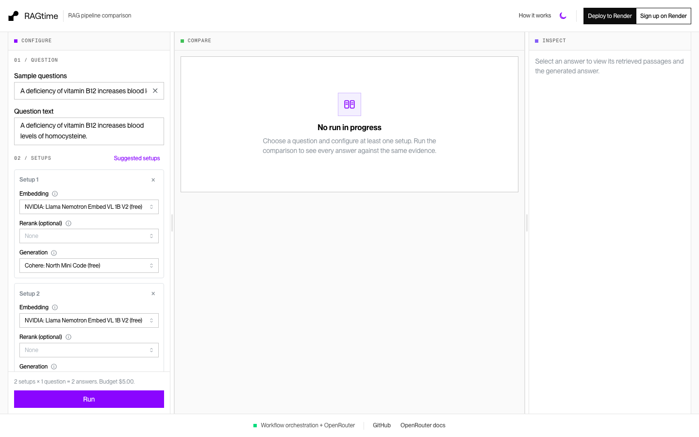
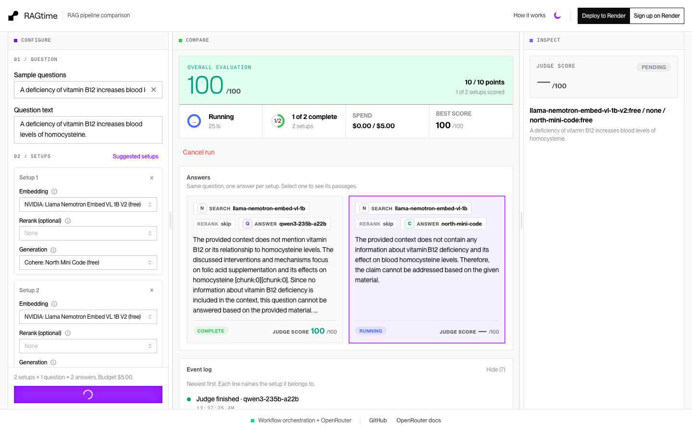
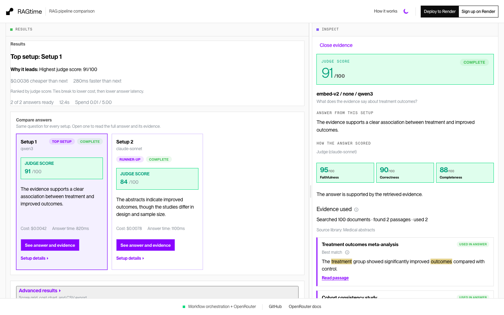

<div align="center">

# Answer Arena

A playground to compare search + answer setups side by side. Pick embedding, optional rerank, and generation models, ask the same question, and compare answers, evidence, cost, and speed. Each setup runs as a durable [Render Workflows](https://render.com/docs/workflows) task and is scored by a shared judge model.

<p>
  <a href="https://render.com/deploy?repo=https://github.com/ojusave/answer-arena">
    
  </a>
</p>

<p>
  <a href="https://ragtime-web.onrender.com/">Live demo</a>
  ·
  <a href="https://render.com/docs/workflows">Workflows docs</a>
  ·
  <a href="https://github.com/ojusave/answer-arena">GitHub</a>
</p>

</div>

## What This Demo Shows

This repo demonstrates how to run a multi-model RAG bake-off on Render:

| Platform | Role |
| --- | --- |
| **[Render Workflows](https://render.com/docs/workflows)** | Fan-out durable tasks for ingest, embed, retrieve, generate, and judge with retries and leases |
| **[OpenRouter](https://openrouter.ai)** | One API key for embeddings, optional rerank, chat, and the judge model |
| **[Render Postgres](https://render.com/docs/databases)** | Corpus chunks, pgvector embeddings, runs, trials, and cost receipts |
| **[Render Web Services](https://render.com/docs/web-services)** | Hosts the API and Compare / Configure / Inspect UI |

## Product tour

Configure setups, run them in parallel, then inspect evidence and scores. These are screenshots from the live deploy.

### Configure

Pick a question and compose one or more setups (embedding + optional rerank + generation).



### Compare

Answers appear side by side. The live execution timeline shows retrieve / rerank / generation / judge as clock-time bars, including retries and failures.



### Inspect

Select an answer to see retrieved passages, stage receipts, and judge dimensions. Failed setups show the provider reason after retries.



### How a comparison runs

1. **Browser** starts a run from Configure
2. **Web service** admits the run, persists the plan, and dispatches `run_bakeoff`
3. **Render Workflows** executes the pipeline:

| Workflow task | What it does |
| --- | --- |
| `ingest_document` / corpus prep | Chunks demo or uploaded text into Postgres |
| `embed_batch` | Embeds missing chunks per embedding model into pgvector |
| `run_trial` | Retrieve → optional rerank → generate → judge for one setup × question |
| `run_bakeoff` | Orchestrates fan-out, aggregation, and run status |

4. Stage events stream into Compare so you can watch concurrency, retries, and cost as they happen

## Quick Start

### Prerequisites

- [Render account](https://dashboard.render.com/register?utm_source=github&utm_medium=referral&utm_campaign=ojus_demos&utm_content=readme_link)
- [OpenRouter API key](https://openrouter.ai/keys)
- [Render API key](https://render.com/docs/api#1-create-an-api-key) (to start and cancel workflow tasks)

### Deploy

1. Click **Deploy to Render** above (or create a Blueprint from [`render.yaml`](render.yaml))
2. Set secrets when prompted:
   - `OPENROUTER_API_KEY`
   - `RENDER_API_KEY`
   - `JUDGE_MODEL` (any chat slug you can call, e.g. `openai/gpt-4o-mini`)
3. Create the Workflow service manually (Blueprints do not create Workflows yet):
   - Dashboard → **New** → **Workflow**
   - Same repo, root directory empty (pnpm workspace needs the repo root)
   - Build: `pnpm install && pnpm build:workflows`
   - Start: `node apps/workflows/dist/index.js`
   - Same region as the web service and Postgres
   - Slug should match `WORKFLOW_SLUG` (Blueprint default: `ragtime-workflows`)
   - Wire `DATABASE_URL`, `OPENROUTER_API_KEY`, `JUDGE_MODEL`, and `APP_URL`
4. Open the web service URL (live demo: https://ragtime-web.onrender.com/), load the demo library, compose two setups, and click **Run**

A small smoke run with budget-tier models usually lands in low single-digit USD, always bounded by `MAX_RUN_BUDGET_USD` (default `$5`).

## Features

| Feature | Description |
| --- | --- |
| **Side-by-side setups** | Compare embedding / rerank / generation stacks on the same question |
| **Live execution timeline** | Gantt-style bars for retrieve, rerank, generation, and judge |
| **Provider failure reasons** | After workflow retries, failed setups show the OpenRouter / dispatcher message |
| **Resumable stages** | Completed retrieve / generate / judge work is checkpointed so retries skip finished work |
| **Per-run budget** | Pre-call reservations and an idempotent cost ledger |
| **Shared-deploy safe** | Session-scoped runs with admission limits per session and deployment-wide |
| **Live model catalog** | Pickers come from OpenRouter; no hardcoded model slug list |

## Configuration

| Variable | Where | Description |
| --- | --- | --- |
| `DATABASE_URL` | Web + Workflow | Render Postgres (pgvector) connection string |
| `OPENROUTER_API_KEY` | Web + Workflow | Model calls and the live catalog |
| `RENDER_API_KEY` | Web | Start and cancel workflow tasks |
| `JUDGE_MODEL` | Web + Workflow | Default judge chat slug; runs are rejected without one |
| `WORKFLOW_SLUG` | Web | Must match the Dashboard workflow slug (`ragtime-workflows`) |
| `APP_URL` | Workflow | Public web URL for OpenRouter `HTTP-Referer` |
| `OPENROUTER_APP_TITLE` | Both | Defaults to `Answer Arena` |
| `MAX_RUN_BUDGET_USD` | Both | Hard per-run ceiling (default `5`) |
| `MAX_PROVIDER_CALL_USD` | Both | Max reserved for one provider call (default `0.5`) |
| `MAX_ACTIVE_RUNS_PER_SESSION` | Web | Concurrent runs per browser session (default `1`; `0` disables) |
| `MAX_ACTIVE_RUNS_TOTAL` | Web | Concurrent runs deployment-wide (default `5`; `0` disables) |
| `CHAOS_FAILURE_RATE` | Workflow | Injected pre-spend failures for resilience demos (default `0`) |

### Shared deployments

Runs are scoped to an anonymous session cookie. Over the admission limit, `POST /api/runs` returns `429` with `session_run_limit` or `global_run_limit`. Reloading reattaches via `GET /api/runs/active`. Worst-case concurrent spend is `MAX_ACTIVE_RUNS_TOTAL × MAX_RUN_BUDGET_USD` (`$25` with Blueprint defaults).

## Project Structure

```
apps/web/                 Fastify API + Vite React SPA
apps/workflows/           Render Workflow tasks (ingest, embed, trial, bake-off)
packages/core/            Ports, pipeline stages, prompts, schemas
packages/composition/     Env-selected gateway + workflow wiring
packages/db/              Drizzle schema, migrations, seed, PgVectorStore
packages/gateway-openrouter/
render.yaml               Blueprint (web + Postgres)
static/images/            README screenshots from the live deploy
```

Internal npm packages still use the `@ragtime/*` scope; that is an implementation detail and does not change the product name.

## Troubleshooting

| Problem | Solution |
| --- | --- |
| Run stays in draft / 502 on start | Check `RENDER_API_KEY`, `WORKFLOW_SLUG`, and that the Workflow service is live in the same region |
| "Judge model required" | Set `JUDGE_MODEL` on web and workflows to a chat slug you can call |
| Setup shows FAILED after retries | Open Inspect / the answer card for the provider reason (rate limit, missing model, credits) |
| `sorry, too many clients already` | Lower `TRIAL_FANOUT_BATCH` / `EMBED_FANOUT_BATCH`, or raise `DB_POOL_MAX` on a larger Postgres plan |
| `429` with an active run | Cancel the current run, or raise `MAX_ACTIVE_RUNS_PER_SESSION` / `MAX_ACTIVE_RUNS_TOTAL` |
| Empty model pickers | Set `OPENROUTER_API_KEY` on the web service; check `/api/models` |

Logs: web service and Workflow service logs in the Render Dashboard.

## Tests

```bash
pnpm test
```

Builds workspace packages, then runs core / db / gateway / web unit tests. Set `TEST_DATABASE_URL` to also run the Postgres budget-recovery suite.

## Learn More

**Render:**
- [Render Workflows](https://render.com/docs/workflows)
- [Render Postgres](https://render.com/docs/databases)
- [Deploy to Render button](https://render.com/docs/deploy-to-render-button)

**OpenRouter:**
- [OpenRouter docs](https://openrouter.ai/docs)
- [Activity / usage](https://openrouter.ai/activity)

## Contributing

Issues and PRs are welcome on [github.com/ojusave/answer-arena](https://github.com/ojusave/answer-arena). Keep changes small and focused; match existing module boundaries (`packages/composition` for wiring, `packages/core` for pipeline logic, `apps/workflows` for durable tasks).
